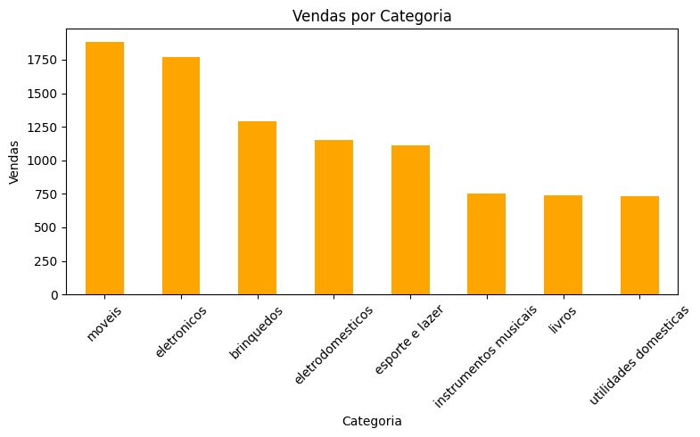
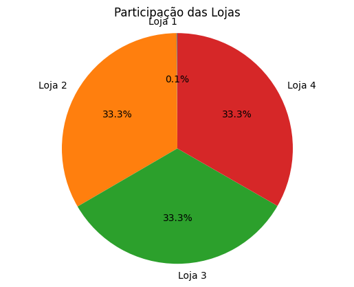
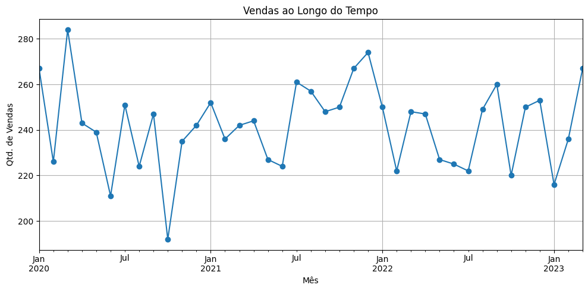

# 📊 Análise de Vendas - Challenge de Data Science | Alura

# Análise de Dados - Alura Store

## 🚀 Propósito da Análise

Este projeto tem como objetivo analisar os dados de vendas de quatro lojas fictícias da **Alura Store**, a fim de fornecer insights importantes sobre o comportamento de vendas, frete, categorias de produtos e avaliações dos clientes. A análise foca nos seguintes pontos principais:

- **Faturamento total** das lojas.
- **Vendas por categoria** de produto.
- **Média de avaliação** de cada loja.
- **Produtos mais e menos vendidos**.
- **Frete médio** por loja.
- **Evolução das vendas ao longo do tempo**.

A análise é realizada usando dados fornecidos através de URLs de arquivos CSV contendo informações sobre as compras realizadas nas lojas, como preço, categoria, avaliação, etc.

## 🗂️ Estrutura do Projeto

O projeto possui a seguinte estrutura de arquivos:

### Descrição dos arquivos:

- **`AluraStoreBr.ipynb`**: Este arquivo contém o código em Python para a análise dos dados das lojas, incluindo visualizações gráficas e cálculos de métricas como faturamento, frete, vendas por categoria, entre outros.
- **`README.md`**: Arquivo de documentação do projeto, explicando o propósito, estrutura e instruções para execução.

## 📊 Exemplos de Gráficos e Insights

Durante a análise, foram gerados diversos gráficos e insights valiosos:

1. **Faturamento total das 4 lojas**:
    - O faturamento total é calculado somando os preços de todos os produtos vendidos nas 4 lojas.

2. **Vendas por categoria**:
    - Um gráfico de barras foi gerado para mostrar o total de vendas por categoria de produto. O gráfico é útil para identificar as categorias mais populares entre os consumidores.

    

3. **Participação das lojas no total de vendas**:
    - Um gráfico de pizza foi gerado para visualizar a participação de cada loja no total de vendas.

    

4. **Evolução das vendas ao longo do tempo**:
    - Um gráfico de linha foi criado para exibir a evolução das vendas mês a mês.

    

5. **Produtos mais e menos vendidos**:
    - Listagem dos 5 produtos mais vendidos e menos vendidos, com base na contagem de unidades vendidas.

6. **Média de avaliação por loja**:
    - A média das avaliações dos clientes foi calculada para cada loja, permitindo comparar a satisfação dos clientes entre as lojas.

7. **Frete médio por loja**:
    - O cálculo do frete médio por loja foi realizado para ajudar a entender o custo de envio médio para cada loja.

## ▶️ Como Executar o Notebook

Para executar este notebook e reproduzir a análise, siga os passos abaixo:

### Requisitos:
1. **Python** instalado em sua máquina.
2. **Google Colab** instalado em sua máquina.
3. Bibliotecas necessárias:
   - `pandas`
   - `matplotlib`
   
Você pode instalar as dependências utilizando o `pip`:

```bash
pip install pandas matplotlib
